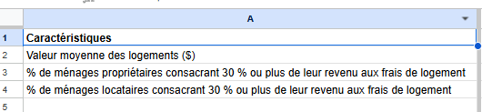
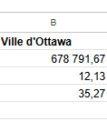
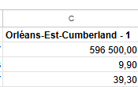
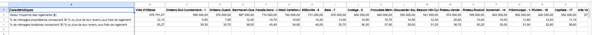
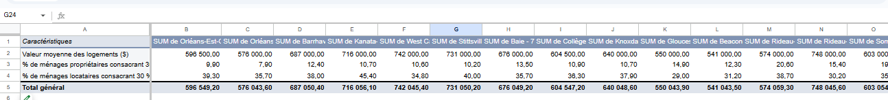
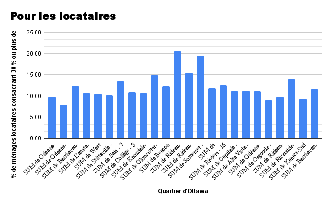

**Date**<br>
**Cote et nom du cours**<br>
**Prénom et nom de l'étudiant(e)**<br>
**Présenté à Jean-Sébastien Marier**<br>

# Analyse exploratoire de données (AED) et proposition

Utilisez un croisillon (`#`) pour créer un intertitre de niveau 1 comme celui-ci.

## Avant-propos

Pour ce travail, vous devez extraire des données d’un site Internet ou d’une base de données. Vous devez ensuite nettoyer et analyser votre jeu de données, trouver une histoire potentielle et créer une visualisation. Votre travail doit clairement expliquer votre processus. Vous devez écrire environ 1500 à 2000 mots et inclure des captures d’écran montrant les différentes étapes de votre analyse. Votre travail doit être rédigé avec le format Markdown et être publié sur GitHub.

J'assigne différentes versions de ce projet à mes étudiants en journalisme numérique et en « data storytelling » depuis déjà quelques années. La structure générale de ce travail est basée sur celle du [*Guide du datajournalisme*](http://jplusplus.github.io/guide-du-datajournalisme/index.html). La présente version est également inspirée du programme [Key Capabilities in Data Science](https://extendedlearning.ubc.ca/programs/key-capabilities-data-science) offert par l'Université de la Colombie-Britannique (UBC).

**Voici quelques ressources utiles pour ce travail :**

* [Page *Syntaxe de base pour l’écriture et la mise en forme* de GitHub](https://docs.github.com/fr/get-started/writing-on-github/getting-started-with-writing-and-formatting-on-github/basic-writing-and-formatting-syntax)
* [Le répertoire modèle pour ce projet au cas où vous effaceriez quelque chose par accident](https://github.com/jsmarier/jou4100_jou4500_mpad2003_project2_template)

Avez-vous remarqué comment créer un hyperlien? En langage Markdown, on met le texte cliquable entre une paire de crochets et l'adresse URL entre parenthèses.

Pour créer une liste non ordonnée, il suffit de mettre une étoile (`*`) devant chaque item.

## 1. Introduction
Ce travail est une analyse pour le cours Journalisme numérique II : Sujets spéciaux (CMN 4500/JOU 4500) et va nous mener à faire un reportage. L’analyse porte sur l’étude d’un jeu de données de la Ville d’Ottawa concernant l’enjeu du logement abordable. Notre objectif est d’examiner dans quels quartiers les ménages dépensent une grande part de leur revenu pour se loger, afin d’identifier le quartier le plus abordable en 2020. Ces données proviennent du recensement de 2021 réalisé par Statistique Canada à partir d’un échantillon de 25 % des ménages.Le fichier contient 26 colonnes et 2603 lignes regroupant des informations démographiques et économiques par quartier, comme la valeur moyenne des logements et le pourcentage de propriétaires et de locataires consacrant 30 % ou plus de leur revenu au logement. Le jeu de données original est disponible sur le portail de données ouvertes de la ville d'Ottawa et la version CSV se trouve sur GitHub. D’abord, nous présenterons l’obtention des données, puis le nettoyage, avant de passer à l’analyse et enfin à la conclusion.

## 2. Obtenir les données

Utilisez deux croisillons (`##`) pour créer un intertitre de niveau 2 comme celui-ci.

**Pour importer les données dans Google Feuilles de calcul :**
Télécharger le fichier CSV en cliquant sur le lien fourni, puis choisissez **Fichier > Enregistrer sous** pour le sauvegarder sur votre ordinateur. 
Ouvrez Google Drive et créez une nouvelle feuille de calcul en cliquant sur **Nouveau > Google Feuilles de calcul**. 
Dans la feuille de calcul, cliquez sur **Fichier > Importer**. 
Cliquez **Téléverser** et sélectionnez le fichier CSV que vous avez téléchargé.
Dans la fenêtre **Importer un fichier**, cliquez sur **Importer les données**. 


<br>
*Figure 1 : La fenêtre d'importation d'un fichier de Google Feuilles de calcul.*

Pour accéder notre Google Feuilles de calcul, veuillez cliquez sur ce lien public : https://docs.google.com/spreadsheets/d/1m5SLJN9SNHpli4yt-i3ZSI0ZNOzCDc_xl0AY0KQlSuY/edit?usp=sharing 

**Voici quelques exemples de fonctions et de lignes de code mises dans des boîtes grises :**

1. Si vous nommez une fonction, mettez là à l'intérieur de guillemets « inclinés » comme ceci : `IMPORTHTML`.
1. Si vous voulez inclure une ligne de code complète, faites la même chose, mais avec tout le code : `=IMPORTHTML("https://en.wikipedia.org/wiki/China"; "table", 5)`.
1. Alternativement, vous pouvez mettre le code dans une boîte indépendante en utilisant le modèle de code ci-dessous :

``` r
=IMPORTHTML("https://en.wikipedia.org/wiki/China"; "table", 5)
```
C'est aussi comme ça qu'on crée une liste ordonnée. Il suffit de mettre `1.` devant chaque item.

## 3. Comprendre les données

### 3.1. Analyse VIMA

Utilisez trois croisillons (`###`) pour créer un intertitre de niveau 3 comme celui-ci. Je vous prie de suivre ce modèle en ce qui a trait aux intertitres de niveaux 1 et 2. Toutefois, je vous laisse le loisir d'utiliser les intertitres de niveau 3 comme bon vous semble.

VIMA est l’acronyme de Valide, Invalide, Manquant et Aberrant. Il s’agit d’une analyse utilisée pour vérifier l’exactitude des données que l’on possède : V pour valide (aucune valeurs manquantes, mais qui se retrouve dans une fourchette valide et sont représentatifs du phénomène à l’étude), I pour invalide (les valeurs impossibles ou qui n’ont aucun sens), M pour manquant (cellule vide), et A pour aberrant (valeurs extrêmement hautes ou basses par rapport à celles attendues). 

Alors, les données sont dites exactes lorsqu'elles décrivent adéquatement les phénomènes qu’elles sont conçues pour mesurer ou représenter. D’où, pour qu’une donnée soit exacte, elle doit être valide et correcte selon [Statistique Canada, 2020](https://www.statcan.gc.ca/fr/afc/litteratie-donnees/catalogue/892000062020008). Dans notre cas, les données que nous avons utilisées portent sur les données ouvertes de la ville d’Ottawa qui portent sur le recensement et l’enquête par sondage de 2021. Pour nous assurer que nos données sont exact nous avons analysé les trois colonnes ci-dessous dans notre jeu de données :
<br>
*Figure 3 : Colonne A*

<br>
*Figure 4 : Colonne B*

<br>
*Figure 5 : colonne C*

Toutes les trois colonnes sont censées représenter les caractéristiques utilisées par les personnes qui ont répondu soit pour le recensement soit pour l’enquête par sondage. Ces colonnes sont valides, car elle représente le phénomène décrit, ne possède pas de valeur impossible, toutes ces cellules sont remplies et ce sont des valeurs attendues. Donc, les colonnes sont une donnée exacte.

Appuyez vos affirmations en citant les sources appropriées. Veuillez suivre les [normes APA en matière d'attribution dans le corps du texte](https://apastyle.apa.org/style-grammar-guidelines/citations).

**Par exemple :**

Comme l'affirme Cairo (2016), une visualisation de données doit être véridique...

### 3.2. Nettoyage des données

Après l’importation de nos données, nous sommes passés à la sélection de différents indicateurs afin de parfaire notre étude et de répondre à notre thèse sur le logement abordable. Pour nous assurer que nous travaillions avec des données fiables, nous avons nettoyé notre jeu de données en suivant plusieurs étapes en utilisant les outils de nettoyage des données de Google Feuilles de calcul :

**1. Correction manuelle des incohérences dans les noms de quartiers**

Nous avons remarqué que certains quartiers manquent un tiret « - » dans leur orthographe, contrairement à la version officielle du site de la Ville d’Ottawa. De plus, un quartier ne possédait que le nom sans sa position dans la liste ; il s’agissait du quartier Rideau-Rockcliffe. Après avoir vérifié le site officiel, [Cartes des quartiers et zones des conseils scolaires – Ville d’Ottawa](https://ottawa.ca/fr/hotel-de-ville/elections/cartes-des-quartiers-et-zones-des-conseils-scolaires), nous avons constaté qu’il occupait la 13ᵉ position et nous avons fait l’ajout nécessaire dans le jeu de données.

**2. Uniformisation des formats de valeurs**
Nous avons ensuite modifié les formats de certaines valeurs afin de pouvoir les traiter comme des nombres. En particulier, nous avons constaté que plusieurs cellules de la ligne « % de ménages propriétaires consacrant 30 % ou plus de leur revenu aux frais de logement » étaient au format date, ce qui rendait la conversion en format numérique difficile.

Pour résoudre ce problème, nous avons utilisé la formule suivante, découverte grâce à l’intelligence artificielle ChatGPT : `=TEXT(B10; "mmd") * 0,1 `. Cette formule nous a permis de convertir les cellules au format nombre tout en conservant leur valeur d’origine.  Concrètement, nous avons sélectionné les 25 colonnes concernées, puis sélectionné sur **Format** > **123 Nombre** > **Nombre**.
 Nous avons décidé de conserver deux décimales afin de préserver la précision de certaines valeurs.

**3. Correction des valeurs erronées pour la colonne “Ville d’Ottawa”**
Certaines données n’étaient pas exactes, notamment dans la colonne de la ville d’Ottawa. Pour corriger cela, nous avons utilisé la formule suivante :`«=MOYENNE(C2:Z2) ».` Cette formule a été appliquée à l’ensemble des indicateurs afin d’obtenir des valeurs plus représentatives sur l’ensemble des 24 quartiers.

**4. Amélioration de la navigation dans le jeu de données**
Enfin, nous avons figé la première colonne ayant nos indicateurs pour faciliter la lecture et la manipulation de notre tableau. 
Pour effectuer cela, nous avons sélectionné **Afficher** > **Figer** >**1 colonne**.

<br>
*Figure 6 : jeux de données après nettoyage*

### 3.3. Analyse exploratoire des données (AED)

Ces variables ont été sélectionnées pour examiner la question du logement abordable à Ottawa sous un angle purement financier. En combinant la valeur moyenne des logements et le pourcentage de ménages propriétaires consacrant 30 % ou plus de leur revenu au logement, on obtient une image claire de la charge financière réelle supportée par les ménages. Une statistique attire particulièrement l’attention : certains quartiers affichent une valeur moyenne avoisinant les 900 000 $, un chiffre qui traduit la montée rapide du coût de l’immobilier et les difficultés croissantes pour accéder à une propriété. L’analyse révèle ainsi une ville marquée par un fort déséquilibre entre les revenus et les prix, où l’accès à un logement adéquat devient de plus en plus restreint pour les ménages à revenu moyen. Toutefois, quelques quartiers, notamment Orléans-Ouest–Innes avec seulement 7,9 % de ménages dépassant le seuil des 30 %,se démarquent par une meilleure stabilité financière.Ces données montrent l'importance d'identifier ces zones ces Zones plus accessibles afin de mieux comprendre les dynamiques économiques locales.Pour la suite,la valeur moyenne des logements mérite une analyse plus approfondie,surtout dans les quartiers où elle avoisine les 900 000 Il serait aussi pertinent de croiser cette variable avec le taux de ménages dépassant 30 % de leur revenu en frais de logement afin de mieux comprendre les inégalités économiques entre quartiers.

**Cette section doit inclure une capture d'écran de votre tableau croisé dynamique, comme ceci :**

<br>
*Figure 7 : Ce tableau croisé dynamique montre...*

**Cette section doit aussi inclure une capture d'écran de votre graphique exploratoire, comme ceci :**

<br>
*Figure 9 : Ce graphique exploratoire % de ménages propriétaires consacrant 30 % ou plus de leur revenu aux frais de logement*

## 4. Récit potentiel

Insérez votre texte ici.

## 5. Conclusion
Ce travail nous a permis de mieux comprendre comment utiliser des données concrètes pour analyser un enjeu réel, en l’occurrence celui du logement abordable à Ottawa.

## 6. Références

Veuillez inclure une liste de vos références ici. Assurez-vous de suivre les [normes APA pour les références](https://apastyle.apa.org/style-grammar-guidelines/references). Les retraits négatifs (*hanging paragraphs*) ne sont pas nécessaires. Le [guide sur l'adaptation APA](https://arts.uottawa.ca/lettres/sites/arts.uottawa.ca.lettres/files/cartu-outils-de-redaction-adaptation-apa.pdf) de l'Université d'Ottawa pourrait également vous être utile.

**Voici un exemple :**

Bounegru, L., & Gray, J. (Eds.). (2021). *The Data Journalism Handbook 2: Towards A Critical Data Practice*. Amsterdam University Press. [https://ocul-crl.primo.exlibrisgroup.com/permalink/01OCUL_CRL/hgdufh/alma991022890087305153](https://ocul-crl.primo.exlibrisgroup.com/permalink/01OCUL_CRL/hgdufh/alma991022890087305153)
