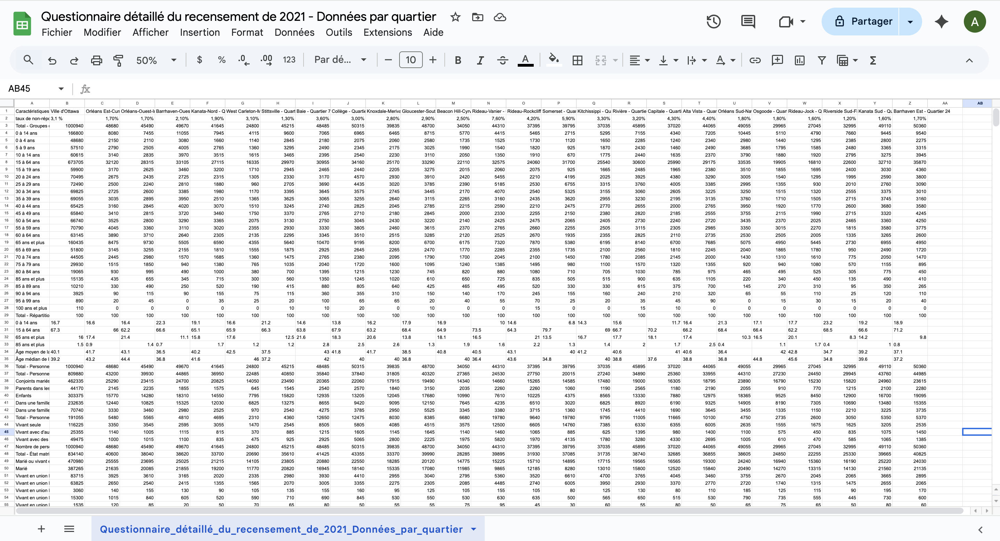
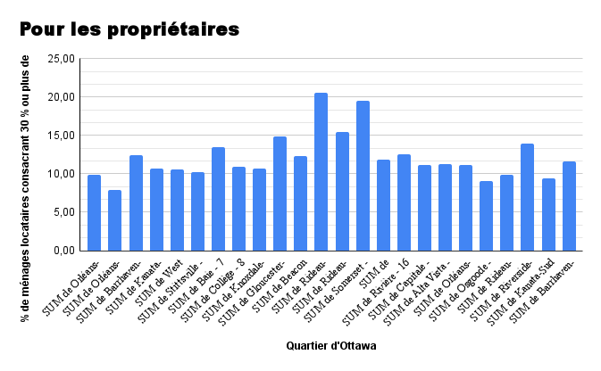

  **11-11-2025** 
**CMN4500/JOU4500 Journalisme numérique II** 
**Benedict Biyangidika,
Angela Chamoun et
Amina Deme** 
**Présenté à Jean-Sébastien Marier** 

# Analyse exploratoire de données (AED) et proposition

## 1. Introduction
Ce travail est une analyse pour le cours Journalisme numérique II : Sujets spéciaux (CMN 4500/JOU 4500) et va nous mener à faire un reportage. L’analyse porte sur l’étude d’un jeu de données de la Ville d’Ottawa concernant l’enjeu du logement abordable. Notre objectif est d’examiner dans quels quartiers les ménages dépensent une grande part de leur revenu pour se loger, afin d’identifier le quartier le plus abordable en 2020. Ces données proviennent du recensement de 2021 réalisé par Statistique Canada à partir d’un échantillon de 25 % des ménages.Le fichier contient 26 colonnes et 2603 lignes regroupant des informations démographiques et économiques par quartier, comme la valeur moyenne des logements et le pourcentage de propriétaires et de locataires consacrant 30 % ou plus de leur revenu au logement. Le jeu de données original est disponible sur le portail de données ouvertes de la ville d'Ottawa et la version CSV se trouve sur GitHub. D’abord, nous présenterons l’obtention des données, puis le nettoyage, avant de passer à l’analyse et enfin à la conclusion.

## 2. Obtenir les données

**Pour importer les données dans Google Feuilles de calcul :**
Télécharger le fichier CSV en cliquant sur le lien fourni, puis choisissez **Fichier > Enregistrer sous** pour le sauvegarder sur votre ordinateur. 
Ouvrez Google Drive et créez une nouvelle feuille de calcul en cliquant sur **Nouveau > Google Feuilles de calcul**. 
Dans la feuille de calcul, cliquez sur **Fichier > Importer**. 
Cliquez **Téléverser** et sélectionnez le fichier CSV que vous avez téléchargé.
Dans la fenêtre **Importer un fichier**, cliquez sur **Importer les données**. 

 
*Figure 1 : La fenêtre d'importation d'un fichier de Google Feuilles de calcul*

Pour accéder notre Google Feuilles de calcul, veuillez cliquez sur ce lien public : https://docs.google.com/spreadsheets/d/1m5SLJN9SNHpli4yt-i3ZSI0ZNOzCDc_xl0AY0KQlSuY/edit?usp=sharing 

### Observations générales 
Plusieurs observations peuvent être faites à partir de ce jeu de données. Ce dernier est accablant, avec 2603 lignes qui touchent différents aspects et 26 colonnes dont 24 énumèrent chaque quartier dans la ville d’Ottawa. Par exemple, pour chaque quartier, nous pouvons observer l’âge, le revenu et la langue de la population. D'ailleurs, les données ne semblent pas propres pour quelques raisons. Premièrement, la colonne O avec Rideau-Rockcliffe n’a pas, « - Quartier 13 » comme le reste des quartiers. Deuxièmement, les valeurs pour certaines informations concernant les Premières Nations, plus précisément de la ligne 382 à la ligne 384, ne sont pas disponibles. Les variables manquantes portent sur le pourcentage de ménages habitant un logement fourni par le gouvernement local, la Première Nation ou la bande indienne consacrant 30 % ou plus de leur revenu aux frais de logement, ainsi que les frais de logement mensuels médians et moyens pour ces types de logements ($). 

### Observations spécifiques 
La ligne 373 dans le Google Feuilles de calcul représente la valeur médiane des logements. Kanata-Nord (Quartier 4) et West Carleton-March (Quartier 5) ont la même valeur de 695 000 $ et Stittsville (Quartier 6) est un peu plus haut avec une valeur médiane de 700 000$. D’ailleurs, la ligne 374 énumère la valeur moyenne, qui est également similaire entre les trois quartiers. Pour ces derniers, la valeur moyenne est autour de 700 000 $. Précisément, Kanata-Nord (716 000 $), West Carleton-March (742 000 $) et Stittsville (731 000 $). Concernant le nombre de propriétaires représenté sur la ligne 300, il y a en beaucoup plus dans les trois quartiers que de locataires. Le montant le plus élevé est à Stittsville où il y a 13 425 comparativement à 2480 locataires. Dans le quartier Kanata-Nord, il y a 11 085 propriétaires et 3935 locataires. Enfin, le quartier West Carleton-March a 8535 propriétaires et 570 locataires. 

Notre question de recherche est la suivante : Quel est le quartier où la plus faible proportion de propriétaires consacrent 30 % ou plus de leur revenu pour leurs frais de logement? 

La Société canadienne d’hypothèques et de logement (SCHL) joue un rôle important dans le secteur de l’habitation au Canada. En plus d’assurer les prêts hypothécaires, elle mène des recherches et produit des rapports sur le logement. L’un des indicateurs clés qu'elle utilise est l’abordabilité du logement. Un logement n'est pas abordable, selon le gouvernement du Canada et les experts, si un ménage y consacre un tiers ou plus de son revenu.

## 3. Comprendre les données

### 3.1. Analyse VIMA

VIMA est l’acronyme de Valide, Invalide, Manquant et Aberrant. Il s’agit d’une analyse utilisée pour vérifier l’exactitude des données que l’on possède : V pour valide (aucune valeurs manquantes, mais qui se retrouve dans une fourchette valide et sont représentatifs du phénomène à l’étude), I pour invalide (les valeurs impossibles ou qui n’ont aucun sens), M pour manquant (cellule vide), et A pour aberrant (valeurs extrêmement hautes ou basses par rapport à celles attendues). 

Alors, les données sont dites exactes lorsqu'elles décrivent adéquatement les phénomènes qu’elles sont conçues pour mesurer ou représenter. D’où, pour qu’une donnée soit exacte, elle doit être valide et correcte selon Statistique Canada (2020). Dans notre cas, les données que nous avons utilisées portent sur les données ouvertes de la ville d’Ottawa qui portent sur le recensement et l’enquête par sondage de 2021. Pour nous assurer que nos données sont exact nous avons analysé les trois colonnes ci-dessous dans notre jeu de données : 

 
*Figure 3 : Colonne A*

 
*Figure 4 : Colonne B*

 
*Figure 5 : Colonne C*

Toutes les trois colonnes sont censées représenter les caractéristiques utilisées par les personnes qui ont répondu soit pour le recensement soit pour l’enquête par sondage. Ces colonnes sont valides, car elle représente le phénomène décrit, ne possède pas de valeur impossible, toutes ces cellules sont remplies et ce sont des valeurs attendues. Donc, les colonnes sont une donnée exacte.

### 3.2. Nettoyage des données

Après l’importation de nos données, nous sommes passés à la sélection de différents indicateurs afin de parfaire notre étude et de répondre à notre thèse sur le logement abordable. Pour nous assurer que nous travaillions avec des données fiables, nous avons nettoyé notre jeu de données en suivant plusieurs étapes en utilisant les outils de nettoyage des données de Google Feuilles de calcul :

**1. Correction manuelle des incohérences dans les noms de quartiers**

Nous avons remarqué que certains quartiers manquent un tiret « - » dans leur orthographe, contrairement à la version officielle du site de la Ville d’Ottawa. De plus, un quartier ne possédait que le nom sans sa position dans la liste ; il s’agissait du quartier Rideau-Rockcliffe. Après avoir vérifié le site officiel, [Cartes des quartiers et zones des conseils scolaires – Ville d’Ottawa](https://ottawa.ca/fr/hotel-de-ville/elections/cartes-des-quartiers-et-zones-des-conseils-scolaires), nous avons constaté qu’il occupait la 13ᵉ position et nous avons fait l’ajout nécessaire dans le jeu de données.

**2. Uniformisation des formats de valeurs**
Nous avons ensuite modifié les formats de certaines valeurs afin de pouvoir les traiter comme des nombres. En particulier, nous avons constaté que plusieurs cellules de la ligne « % de ménages propriétaires consacrant 30 % ou plus de leur revenu aux frais de logement » étaient au format date, ce qui rendait la conversion en format numérique difficile.

Pour résoudre ce problème, nous avons utilisé la formule suivante, découverte grâce à l’intelligence artificielle ChatGPT : `=TEXT(B10; "mmd") * 0,1 `. Cette formule nous a permis de convertir les cellules au format nombre tout en conservant leur valeur d’origine.  Concrètement, nous avons sélectionné les 25 colonnes concernées, puis sélectionné sur **Format > 123 Nombre > Nombre**.
 Nous avons décidé de conserver deux décimales afin de préserver la précision de certaines valeurs.

**3. Correction des valeurs erronées pour la colonne « Ville d’Ottawa »**
Certaines données n’étaient pas exactes, notamment dans la colonne de la ville d’Ottawa. Pour corriger cela, nous avons utilisé la formule suivante :`«=MOYENNE(C2:Z2) ».` Cette formule a été appliquée à l’ensemble des indicateurs afin d’obtenir des valeurs plus représentatives sur l’ensemble des 24 quartiers.

**4. Amélioration de la navigation dans le jeu de données**
Enfin, nous avons figé la première colonne ayant nos indicateurs pour faciliter la lecture et la manipulation de notre tableau. 
Pour effectuer cela, nous avons sélectionné **Afficher > Figer > 1 colonne**.

 
*Figure 6 : Jeux de données après nettoyage*

### 3.3. Analyse exploratoire des données (AED)

Ces variables ont été sélectionnées pour examiner la question du logement abordable à Ottawa sous un angle purement financier. En combinant la valeur moyenne des logements et le pourcentage de ménages propriétaires consacrant 30 % ou plus de leur revenu au logement, on obtient une image claire de la charge financière réelle supportée par les ménages. Une statistique attire particulièrement l’attention : certains quartiers affichent une valeur moyenne avoisinant les 900 000 $, un chiffre qui traduit la montée rapide du coût de l’immobilier et les difficultés croissantes pour accéder à une propriété. L’analyse révèle ainsi une ville marquée par un fort déséquilibre entre les revenus et les prix, où l’accès à un logement adéquat devient de plus en plus restreint pour les ménages à revenu moyen. Toutefois, quelques quartiers, notamment Orléans-Ouest–Innes avec seulement 7,9 % de ménages dépassant le seuil des 30 %, se démarquent par une meilleure stabilité financière.Ces données montrent l'importance d'identifier ces zones ces Zones plus accessibles afin de mieux comprendre les dynamiques économiques locales. Pour la suite,la valeur moyenne des logements mérite une analyse plus approfondie, surtout dans les quartiers où elle avoisine les 900 000. Il serait aussi pertinent de croiser cette variable avec le taux de ménages dépassant 30 % de leur revenu en frais de logement afin de mieux comprendre les inégalités économiques entre quartiers.

 
*Figure 7 : Tableau croisé dynamique*

 
*Figure 8 : Graphique exploratoire montrant le pourcentage de ménages propriétaires consacrant 30 % ou plus de leur revenu aux frais de logement*

## 4. Récit potentiel

Le récit potentiel que nous souhaitons approfondir porte sur la relation entre la valeur moyenne des logements à Ottawa et le pourcentage de ménages consacrant 30 % ou plus de leur revenu au logement. L’objectif serait  de comprendre, dans une perspective exclusivement financière, ce qui influence les ménages dans leur décision d’acheter une maison, le budget qu’ils prévoient y consacrer et la façon dont leur pouvoir d’achat est calculé lorsqu’ils choisissent un quartier en particulier. Pour raconter cette histoire, il serait nécessaire d’obtenir davantage de données précises sur le revenu médian par quartier, les taux hypothécaires moyens et les dépenses associées à la propriété. Il serait aussi pertinent d’interviewer des ménages propriétaires qui consacrent 30 % ou plus de leur salaire au financement de leur maison, afin de mieux comprendre leur réalité économique. Les sources comme la Société canadienne d’hypothèques et de logement (SCHL), reconnue comme référence au Canada dans le domaine du logement, ainsi que les jeux de données publiés par la Ville d’Ottawa ou encore le Housing Affordability Monitor de la Banque Nationale du Canada, nous permettraient d’indiquer et d’expliquer avec une certaines précision les résultats que nous pourrions réaliser.

## 5. Conclusion
Ce travail nous a permis de mieux comprendre comment utiliser des données concrètes pour analyser un enjeu réel, en l’occurrence celui du logement abordable à Ottawa. Tout au long du processus, nous avons appris à observer, nettoyer et interpréter les données tout en restant concentrés sur une approche simple et logique. Cette simplicité, que le cours met de l’avant, nous a aidés à ne pas nous perdre dans les détails et à garder un regard clair sur notre objectif principal. Le plus difficile a été de sélectionner des indicateurs cohérents pour notre étude et d’établir une question principale précise, sans trop nous écarter du sujet. Nous devions trouver un équilibre entre la richesse du jeu de données et la clarté de notre démarche. Ce qui a été le plus gratifiant a été de voir comment les instructions théoriques pouvaient être appliquées concrètement dans un cadre qui ressemble à un travail professionnel. Cela nous a aussi montré qu’avec une méthode simple, on peut arriver à des résultats solides et compréhensibles. Ce travail nous a aussi montré certaines lacunes dans nos connaissances, surtout dans l’observation des colonnes et le nettoyage des données. Avec un peu plus de temps, nous aurions pu approfondir le lien entre la valeur moyenne des logements et le revenu des ménages. En général, cet exercice nous a vraiment aidé à lier la théorie à la pratique et à mieux comprendre la réalité du logement à Ottawa.

## 6. Références

Société canadienne d’hypothèques et de logement (SCHL). (2025). Housing Affordability Monitor: Affordability improves for a sixth consecutive quarter in Q2 2025.
 https://www.cmhc-schl.gc.ca/professionnels/marche-du-logement-donnees-et-recherche/recherche-sur-le-logement/les-besoins-imperieux-en-matiere-de-logement/determiner-les-besoins-imperieux-en-matiere-de-logement 

Ville d’Ottawa. (2025). Cartes des quartiers et zones des conseils scolaires.
https://ottawa.ca/fr/hotel-de-ville/elections/cartes-des-quartiers-et-zones-des-conseils-scolaires

Statistique Canada. (2024). Exactitude et validation des données : méthodes pour assurer la qualité des données.
 https://www.statcan.gc.ca/fr 

OpenAI. (2025). ChatGPT [modèle d’intelligence artificielle].
